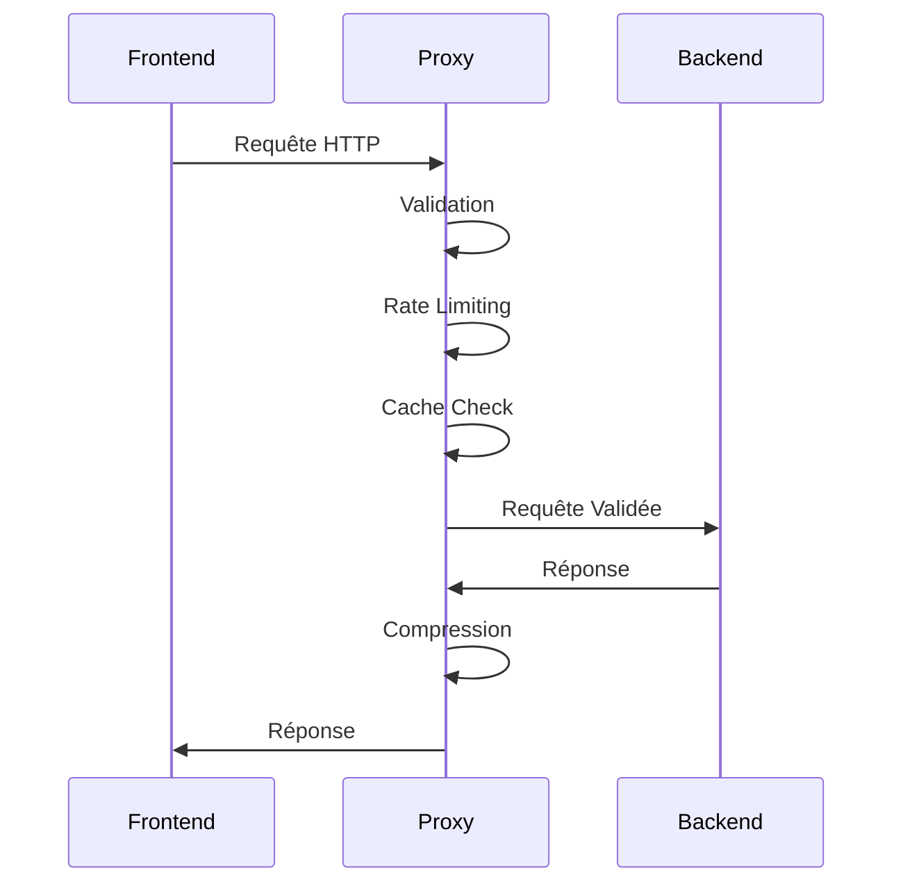
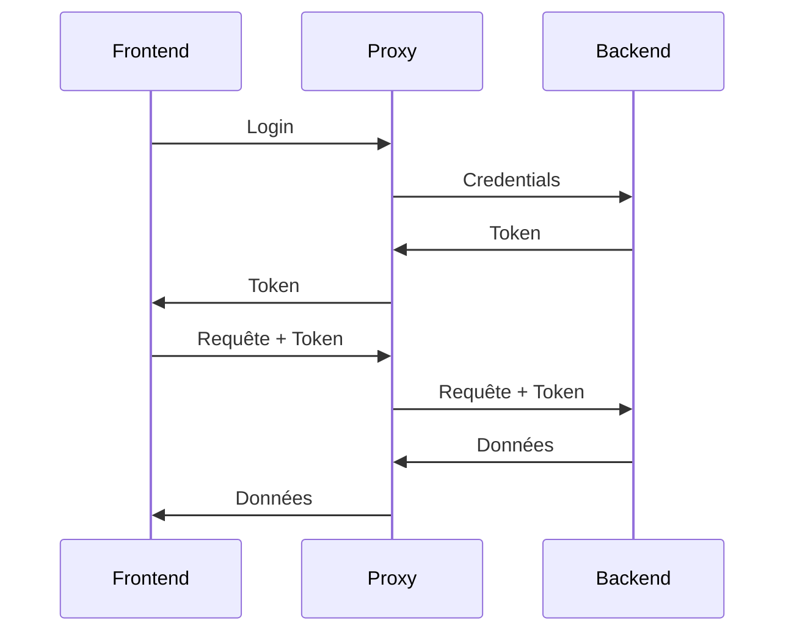
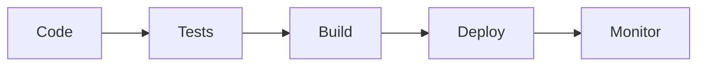

# Guide d'Architecture

## Vue d'ensemble

L'application est construite selon une architecture en couches, avec un proxy API servant d'intermédiaire entre le frontend et le backend.

## Architecture

### Schéma

```
+----------------+     +----------------+     +----------------+
|                |     |                |     |                |
|    Frontend    | --> |  Proxy API     | --> |    Backend     |
|                |     |                |     |                |
+----------------+     +----------------+     +----------------+
        |                     |                      |
        v                     v                      v
+----------------+     +----------------+     +----------------+
|                |     |                |     |                |
|     Cache      |     |     Logs       |     |   Database     |
|                |     |                |     |                |
+----------------+     +----------------+     +----------------+
```

### Composants

#### 1. Frontend

- Application web React
- Gestion d'état avec Redux
- Routing avec React Router
- Styling avec Tailwind CSS

#### 2. Proxy API

- Gestion des requêtes
- Sécurité
- Performance
- Monitoring

#### 3. Backend

- API REST
- Authentification
- Base de données
- Logique métier

## Structure des Fichiers

```
front/
├── api-bridge.php          # Point d'entrée du proxy
├── config/                 # Configuration
│   ├── proxy.php          # Configuration du proxy
│   ├── error-handler.php  # Gestion des erreurs
│   └── performance.php    # Configuration performance
├── tools/                  # Outils
│   ├── proxy-test-suite.php # Tests
│   └── metrics-dashboard.php # Dashboard
├── cache/                  # Cache
├── logs/                   # Logs
├── metrics/                # Métriques
└── docs/                   # Documentation
```

## Flux de Données

### 1. Requête Frontend



### 2. Authentification



## Sécurité

### 1. Couches de Sécurité

```
+----------------+
|                |
|   Frontend     |
|                |
+----------------+
        |
+----------------+
|                |
|   Proxy API    |
|                |
+----------------+
        |
+----------------+
|                |
|    Backend     |
|                |
+----------------+
```

### 2. Mesures de Sécurité

- SSL/TLS
- CORS
- Rate Limiting
- Validation des entrées
- Headers de sécurité
- Logging sécurisé

## Performance

### 1. Optimisations

- Cache
- Compression
- Timeouts adaptatifs
- Métriques
- Monitoring

### 2. Métriques

- Temps de réponse
- Utilisation mémoire
- Taux de cache
- Taux de compression

## Gestion des Erreurs

### 1. Types d'Erreurs

- Erreurs de validation
- Erreurs d'authentification
- Erreurs de rate limiting
- Erreurs de backend
- Erreurs système

### 2. Gestion

- Logging
- Rotation des logs
- Alertes
- Monitoring

## Monitoring

### 1. Métriques

- Performance
- Sécurité
- Système
- Business

### 2. Outils

- Dashboard
- Alertes
- Rapports
- Exports

## Déploiement

### 1. Environnements

- Développement
- Test
- Staging
- Production

### 2. Processus



## Maintenance

### 1. Tâches Régulières

- Rotation des logs
- Nettoyage du cache
- Mise à jour des métriques
- Vérification de sécurité

### 2. Procédures

- Backup
- Restore
- Update
- Rollback

## Support

### 1. Documentation

- Installation
- Configuration
- API
- Métriques
- Architecture

### 2. Outils

- Tests
- Monitoring
- Logging
- Alertes

## Évolution

### 1. Roadmap

- Amélioration des performances
- Nouvelles fonctionnalités
- Mise à jour de sécurité
- Optimisation du code

### 2. Versions

- Version 1.0 : Base
- Version 1.1 : Sécurité
- Version 1.2 : Performance
- Version 1.3 : Monitoring
